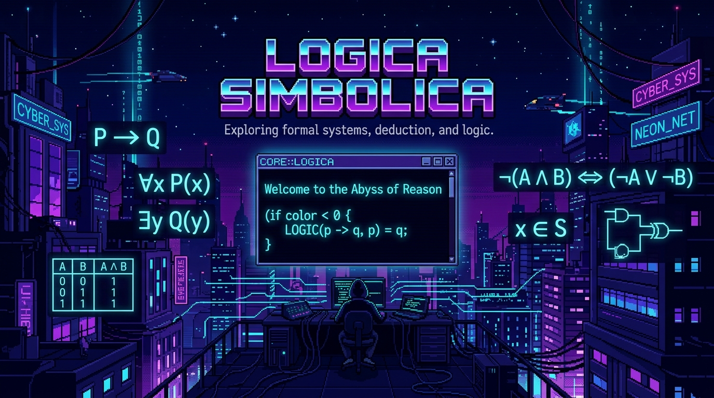

# 🧠 Lógica Simbólica Global - Proyecto de Aula 2026

 *(Estilo Cyberpunk 16-bits para Lógica Simbólica)*

Bienvenidos al repositorio central del proyecto **Lógica Simbólica Global**.
El **Objetivo Único (Norte)** de este proyecto es construir, de manera colaborativa, una plataforma web completa e interactiva para que cualquier persona en el mundo aprenda y aplique Lógica Simbólica.

---

## 🚀 La Métrica de Éxito
Lograr que el 100% de los temas del sílabo estén implementados funcionalmente antes de nuestra **Fecha Inamovible: 30 de Agosto de 2026**.

## ⚡ Stack Tecnológico Oficial
- **Framework Web:** Vue 3 (Single File Components `.vue`) + Vite
- **Enrutamiento:** Vue Router
- **Estilos:** Tailwind CSS v4
- **Lenguaje:** TypeScript

---

## 👥 Organización de los Equipos (Distribución del Sílabo 16 Semanas)
Cada estudiante es un desarrollador dentro de uno de los 6 Equipos de Dominio. Cada equipo tiene un **Sublíder** responsable de consolidar y comunicarse con GitHub para subir los avances.

| # | Nombre | Sublíder | Integrantes | Tema | Carpeta |
|---|---|---|---|---|---|
| 1 | Los hijos de Linus | Arom | Centurión, Morocho, Altamirano, Mio | Reglas de Inferencia | `/src/pages/inferencias` |
| 2 | Sinergia | Alexa | Aldair, Smith, Miguel Velarde, Jesús Núñez | Tablas de Verdad y Leyes | `/src/pages/tablas` |
| 3 | (por definir) | (por definir) | — | Fundamentos y Conectivos | `/src/pages/fundamentos` |
| 4 | (por definir) | (por definir) | — | Cuantificadores y Silogismos | `/src/pages/cuantificadores` |
| 5 | (por definir) | (por definir) | — | Teoría de Conjuntos | `/src/pages/conjuntos` |
| 6 | (por definir) | (por definir) | — | Operaciones y Diagramas de Venn | `/src/pages/operaciones_conjuntos` |

---

## 🏆 ¿Cómo ganarás tu nota en este proyecto?
El trabajo se evalúa directamente sobre tu aporte a la plataforma. La rúbrica es la siguiente:

- **🧠 Lógica Matemática (40%):** El algoritmo o función matemática que programaste evalúa correctamente las fórmulas (ej. la tabla de verdad no miente, el Modus Ponens es exacto).
- **🎨 Estética y UI (30%):** Tu componente se ve profesional. Has usado bien Tailwind CSS para que el usuario entienda qué hacer.
- **🤝 Trabajo en Equipo y Git (30%):** Has seguido los lineamientos de tu sublíder, entregado a tiempo en los sprints (PRs los Viernes 4-6 PM) y aportado ideas limpias.

> [!WARNING]
> **REGLA DE EVALUACIÓN OFICIAL:** 
> En este repositorio **SOLO** se evalúa el producto que entregan (el código, la lógica y la interfaz). Si el profesor del curso realiza preguntas teóricas para validar sus conocimientos sobre el tema, esa es una evaluación completamente independiente que depende enteramente de su estudio personal.

---

## 👩‍💻👨‍💻 Flujo de Trabajo (¡Si eres miembro, lee esto!)

Aunque **solo los sublíderes tienen acceso a subir código directamente a GitHub**, **TÚ** eres el motor del equipo. Así es como todos participan:

1. **Tu Backlog Personal (Notas):** Como miembro, llevarás un registro en tus notas personales de las ideas, diseños matemáticos o bocetos de código que vayas creando localmente asistido por **Antigravity**.
2. **Refinamiento:** Cuando tienes un algoritmo o un diseño "refinado" y probado, se lo entregas a tu sublíder.
3. **El Pull Request (PR):** Tu sublíder tomará tus aportes refinados y los unirá en un "Pull Request" (una propuesta de cambio) en GitHub.
4. **El Horario de Revisión:** Nuestro líder de proyecto (Enri) se sentará a revisar y aprobar PRs **todos los Viernes de 4:00 PM a 6:00 PM**. ¡Asegúrate de que tu sublíder envíe tu código antes de esa hora!
5. **Reconocimiento Público:** Cuando el proyecto esté terminado, la plataforma web tendrá una sección interactiva de **"Colaboradores"** donde aparecerá tu nombre y foto por haber aportado código real. ¡Podrás poner este enlace en tu currículum como experiencia de desarrollo de software!

---

## 📌 Enlaces Rápidos
- 📅 **Fechas y Sprints:** `CRONOGRAMA.md`
- 🗺️ **Índice del Repositorio:** `MAPA.md`
- 📖 **Tutoriales y Ayuda:** `GUIA_ESTUDIANTE.md`
- 📋 **Instrucciones de la tarea actual:** `TAREAS/01_Propuesta.md`
