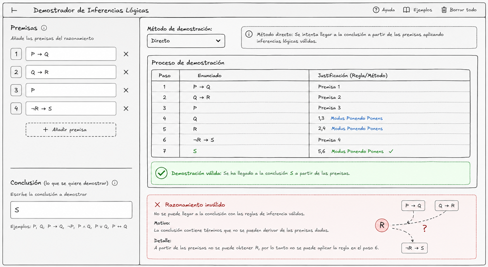

# **PROPUESTA**

## Validador de Razonamientos lógicos
> **Equipo:** Hijos de Linus

> **Integrantes:** 
Espinoza Arom, Centurión Alex, Mio Arnold, Morocho Juan, Altamirano Renatto

**Tema:** Inferencias Lógicas

> ## **1. Problema a Resolver**
Dificultad para demostrar razonamientos mediante inferencias lógicas válidas
> ### **2. Funcionalidad Propuesta**
Te pide las premisas y la conclusión que se quiere demotrasr. Luego de pide el método para resolver (directo o indirecto)
> ### **3. Boceto Visual (Wireframe)**

### Observación:
Para un desarrollo eficiente la plataforma debe conocer las equivalencias lógicas para reescribir las premisas según sea conveniente

