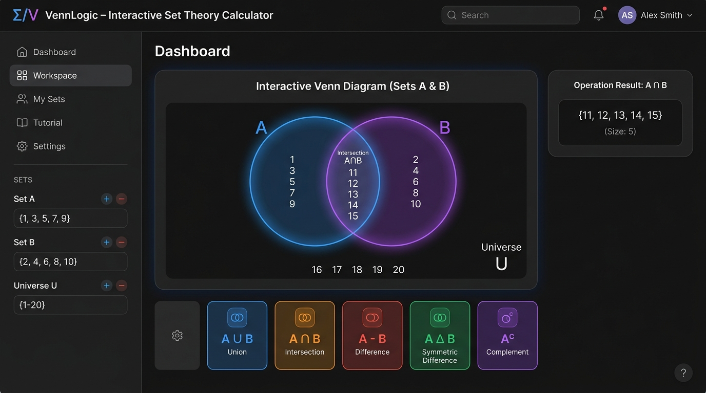
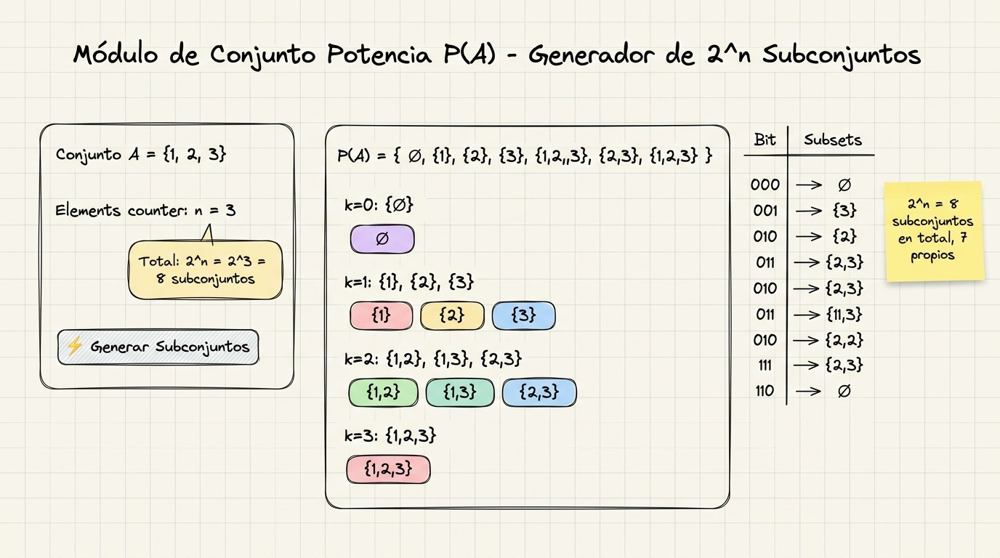
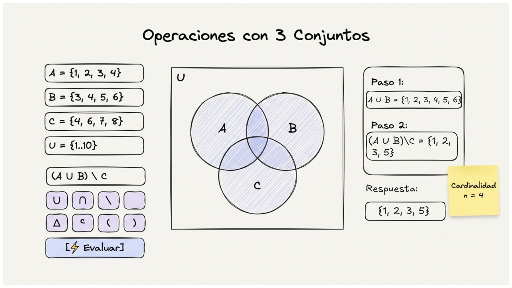
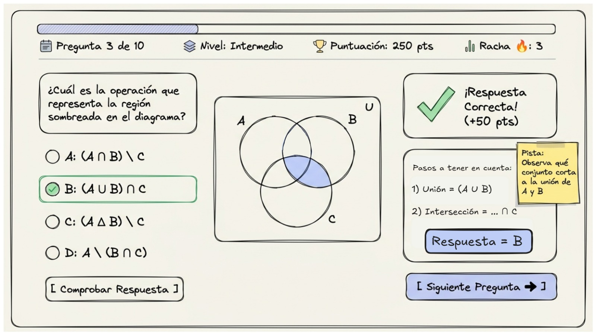
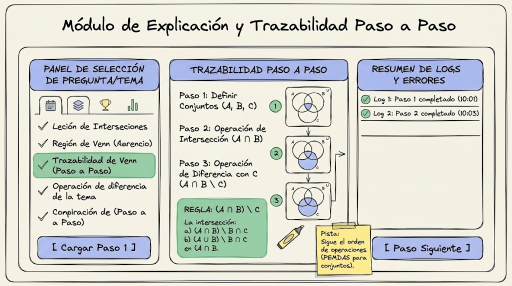

# Asistente e Intérprete de Teoría de Conjuntos y Diagramas de Venn

**Equipo:** Equipo Linus  
**Integrantes:** Jordy (Sublíder), Junior, Mike, Sergio, Fernando, Alejandro  
**Tema:** Teoría de Conjuntos y Diagramas  

---

### 1. Problema a Resolver

El aprendizaje de la Teoría de Conjuntos y los Diagramas de Venn en estudiantes universitarios presenta dos dificultades principales:
1. **Dificultad en la visualización espacial y cálculo de operaciones:** A los estudiantes les cuesta comprobar de forma rápida si una operación entre dos o tres conjuntos produce el resultado correcto y qué elementos exactos pertenecen a cada región del diagrama.
2. **Dificultad en el cálculo del Conjunto Potencia y relaciones de pertenencia/inclusión:** Muchos estudiantes confunden pertenencia con inclusión y tienen problemas para listar manualmente todos los subconjuntos.

---

### 2. Funcionalidad Propuesta

La herramienta consistirá en un sistema web interactivo compuesto por **dos módulos principales**:

#### 🔵 2.1. Calculadora de Conjuntos y Diagrama de Venn
* El usuario ingresa un Universo U y los conjuntos A, B y opcionalmente C.
* Permite elegir entre Unión, Intersección, Diferencia, Diferencia Simétrica, Complemento o Conjunto Potencia.
* Genera el Diagrama de Venn iluminando en tiempo real la región correspondiente.

#### 🟢 2.2. Evaluador de Propiedades y Práctica Guiada
* Comprueba automáticamente si A ⊆ B, si A = B, o si son disjuntos.
* Genera todos los subconjuntos del Conjunto Potencia con explicación paso a paso.
* Permite a los estudiantes validar sus ejercicios de forma inmediata.

---

### 3. Boceto Visual (Wireframe)

#### Módulo de Calculadora e Interfaz de Venn (Jordy)

#### Módulo de Verificación de Subconjuntos (Junior)

#### Módulo de Conjunto Potencia (Mike)

#### Módulo de Operaciones con 3 Conjuntos (Sergio)

#### Módulo de Ejercicios Didácticos (Fernando)

#### Módulo de Explicación Paso a Paso (Alejandro)

---

### Observación

La herramienta busca integrar un módulo de resolución y graficación de Venn con un componente didáctico de verificación de propiedades para fortalecer los conceptos de Teoría de Conjuntos.